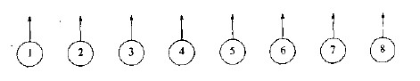
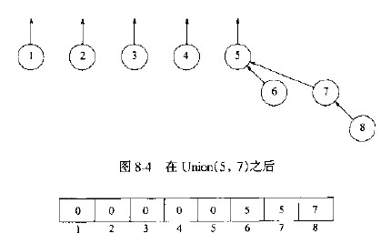

## 不相交集ADT

#### 等价关系
等价关系满足下列三个性质的关系：
* 自反性
* 对称性
* 传递性
 

#### 动态等价性问题
给定一个等价关系“~”，一个问题是对任意a和b，确定a~b。

一个等价类是全集S的一个子集，只需验证a和b是否都在一个等价类中。

输入数据是N个集合的类，每个集合有一个不同元素，使得这些集合不相交。

有两种运算：
* Find：返回给定元素的集合（即等价类的名字）。复杂度O(N)
* Union：把含有a和b两个等价类合并成一个新的等价类。

  
 

  
 
