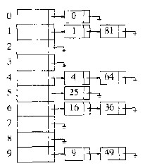
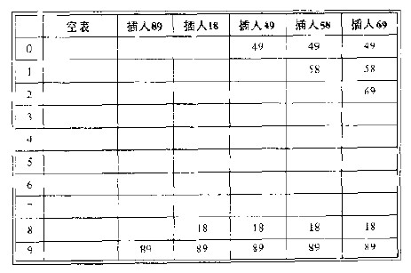
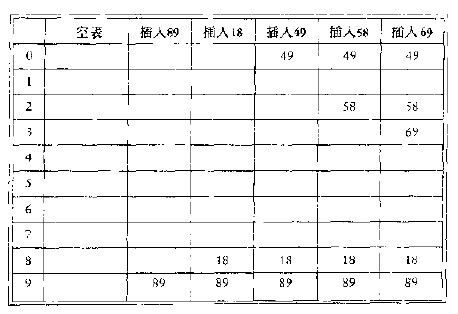

## 散列表
散列表是包含有关键字的具有固定大小的数组。

散列表的实现叫做散列，散列是一种用于常数平均时间插入、删除和查找的技术。但是，那些需要元素间任何排序信息的操作将不会得到有效的支持。
 

#### 散列函数
每个关键字被映射到从0到TableSize-1这个范围中的某个数，并且被放到适当的单元中，这个映射较散列函数。

散列函数实现的几种方式：
* 求模取余
* 字符串ASCII码值相加
* 多项式函数
 

#### 解决冲突的方法
1. 分离链接法

  
 

分离链接散列算法的缺点是需要指针，由于给新单元分配地址需要时间，因此这就导致算法的速度有些慢，同时算法还需要对另一种数据结构的实现。
 

#### 开发地址法
开放地址法的种类：
* 线性探测，容易产生一次聚集。

  
 

* 平方探测，容易产生二次聚集。

  
 

* 在散列，需要额外的操作O(N)。
 

#### 哈希与二叉树的对比
查找的平均时间：

哈希：O(1)
二叉树：O(NlogN)

查找的方式：

哈希：单纯的查找某个元素。
二叉树：提供查找最小元，查找某一范围内的所有项等例程。
 

#### 应用
* Python字典类型的底层支持。
* 编译器的符号表,跟踪源代码中s声明的变量。